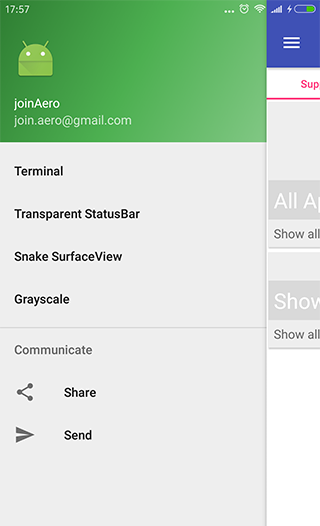
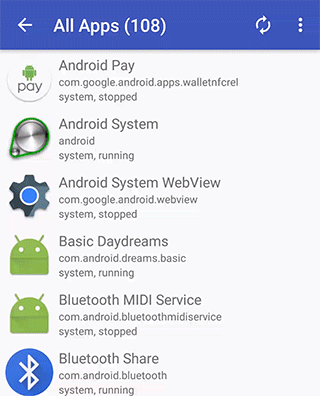

# DroidTurbo

[](https://developer.android.com/studio/index.html)

Android sample project shows new stuff about support library, architecture, etc.

## Get ready

* Download dependencies (using curl): OpenCV4Android.

```
$ cd DroidTurbo/
$ ./get_ready.sh
```

Besides, you could checkout `master-cuda` to use CUDA.

The samples marked by "\*" means having cuda implementations.

## Sample modules

### Menu

* Terminal
* Transparent StatusBar
* Snake SurfaceView
* Grayscale *



### Widget

Samples about new APIs in support libraries.

#### Support

* All Apps: Show all apps in list or grid. 
* Rx Apps: Show all apps with RxJava. 


#### Design

* Bottom Sheet: How to using bottom sheet.


#### Hardware

* Camera2 Basic: How to use basic functionalities of Camera2 API.
* Camera2 Image: How to capture image without preview using Camera2 API.

#### Custom


#### Extras

* Toolbar, TabLayout. 

### Fever

Samples about fever things.

#### OpenGL ES

* Hello GL2: Draws a triangle using GLES 2.0 API.
* Hello Cube: Draws a cube using GLES 1.x API.
* San Angeles: San Angeles Observation OpenGL ES version example.


#### OpenCV

* Tutorial 1: OpenCV Tutorial 1: Camera Preview.
* Tutorial 2: OpenCV Tutorial 2: Mixed Processing.
* Tutorial 3: OpenCV Tutorial 3: Camera Control.
* Camera Calibration: OpenCV Camera Calibration.
* Face Detection: OpenCV Face Detection.
* OpenCV Grayscale: OpenCV Grayscale Sample. *
* OpenCV ORB: OpenCV ORB Sample. *


### Arch

Samples about latest architectures.

#### References

* [Android Architecture Blueprints](https://github.com/googlesamples/android-architecture)
* [Android Architecture Components](https://developer.android.com/topic/libraries/architecture/index.html)
* [Android Architecture Components samples](https://github.com/googlesamples/android-architecture-components)

## Third Party

* [Butter Knife](https://github.com/JakeWharton/butterknife)
* [RxAndroid](https://github.com/ReactiveX/RxAndroid)
* [android-gif-drawable](https://github.com/koral--/android-gif-drawable)

## License

    Copyright 2015 joinAero

    Licensed under the Apache License, Version 2.0 (the "License");
    you may not use this file except in compliance with the License.
    You may obtain a copy of the License at

       http://www.apache.org/licenses/LICENSE-2.0

    Unless required by applicable law or agreed to in writing, software
    distributed under the License is distributed on an "AS IS" BASIS,
    WITHOUT WARRANTIES OR CONDITIONS OF ANY KIND, either express or implied.
    See the License for the specific language governing permissions and
    limitations under the License.


[Studio Keymaps]: http://www.developerphil.com/android-studio-tips-tricks-moving-around/
